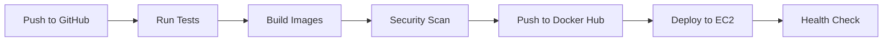

# RevHub CI/CD Setup Guide

This guide will help you set up a complete CI/CD pipeline for RevHub using Docker, GitHub, Jenkins, and AWS EC2.

## 🏗️ Architecture Overview

```
GitHub Repository → Jenkins/GitHub Actions → Docker Hub → AWS EC2
```

- **Source Control**: GitHub
- **CI/CD**: Jenkins + GitHub Actions
- **Container Registry**: Docker Hub
- **Deployment**: AWS EC2 with Docker Compose
- **Monitoring**: Built-in health checks and logging

## 📋 Prerequisites

### 1. Accounts & Services
- [x] GitHub account
- [x] Docker Hub account
- [x] AWS account with EC2 access
- [x] Jenkins server (optional, can use GitHub Actions only)

### 2. Local Tools
- [x] Docker & Docker Compose
- [x] AWS CLI
- [x] Git
- [x] SSH client

## 🚀 Quick Setup (5 Steps)

### Step 1: Configure Docker Hub

1. **Create Docker Hub repositories**:
   ```bash
   # Create these repositories on Docker Hub:
   your-username/revhub-backend
   your-username/revhub-frontend
   ```

2. **Update configuration files**:
   - Replace `your-dockerhub-username` in all files with your actual Docker Hub username
   - Files to update: `Jenkinsfile`, `docker-compose.prod.yml`, `.github/workflows/ci-cd.yml`

### Step 2: Setup AWS EC2

1. **Launch EC2 instance**:
   ```bash
   # Use Ubuntu 22.04 LTS
   # Instance type: t3.medium or larger
   # Security groups: Allow ports 22, 80, 443, 8080
   ```

2. **Run setup script**:
   ```bash
   # Copy ec2-setup.sh to your EC2 instance
   scp ec2-setup.sh ubuntu@your-ec2-ip:/home/ubuntu/
   
   # SSH to EC2 and run setup
   ssh ubuntu@your-ec2-ip
   chmod +x ec2-setup.sh
   ./ec2-setup.sh
   
   # Reboot after setup
   sudo reboot
   ```

### Step 3: Configure GitHub Secrets

Add these secrets to your GitHub repository (Settings → Secrets and variables → Actions):

```bash
# Docker Hub
DOCKER_HUB_USERNAME=your-dockerhub-username
DOCKER_HUB_TOKEN=your-dockerhub-token

# AWS EC2
EC2_HOST=your-ec2-public-ip
EC2_SSH_KEY=your-private-ssh-key-content

# Optional: Slack notifications
SLACK_WEBHOOK=your-slack-webhook-url
```

### Step 4: Setup Jenkins (Optional)

If using Jenkins, configure these credentials:

1. **Jenkins Credentials**:
   - `docker-hub-credentials`: Docker Hub username/token
   - `aws-credentials`: AWS access key/secret
   - `ec2-host`: EC2 public IP
   - `ec2-ssh-key`: SSH private key for EC2

2. **Required Jenkins Plugins**:
   - Docker Pipeline
   - AWS Steps
   - SSH Agent
   - Slack Notification (optional)

### Step 5: Deploy

Choose your deployment method:

#### Option A: GitHub Actions (Recommended)
```bash
# Push to main branch triggers production deployment
git push origin main

# Push to develop branch triggers staging deployment
git push origin develop
```

#### Option B: Jenkins Pipeline
```bash
# Configure webhook in GitHub to trigger Jenkins builds
# Or manually trigger builds in Jenkins
```

#### Option C: Manual Deployment
```bash
# Set environment variables
export DOCKER_HUB_USERNAME=your-username
export EC2_HOST=your-ec2-ip

# Run deployment script
chmod +x deploy.sh
./deploy.sh
```

## 🔧 Configuration Details

### Environment Variables

Create `.env` file in your EC2 deployment directory:

```bash
# Copy from template
cp .env.example .env

# Edit with your values
nano .env
```

### Docker Images

The pipeline builds and pushes these images:
- `your-username/revhub-backend:latest`
- `your-username/revhub-frontend:latest`
- `your-username/revhub-backend:build-number`
- `your-username/revhub-frontend:build-number`

### Health Checks

The deployment includes automatic health checks:
- Backend: `http://your-ec2-ip:8080/api/actuator/health`
- Frontend: `http://your-ec2-ip/`

## 📊 Monitoring & Maintenance

### Built-in Monitoring

```bash
# Check system status
/home/ubuntu/monitor.sh

# View application logs
docker logs revhub-backend
docker logs revhub-frontend

# Check running containers
docker ps
```

### Backup & Recovery

```bash
# Manual backup
/home/ubuntu/backup.sh

# Automated backups run daily at 2 AM
# Backups stored in /home/ubuntu/backups/
```

### Log Management

```bash
# Application logs
tail -f /home/ubuntu/logs/monitor.log
tail -f /home/ubuntu/logs/backup.log

# Docker logs
docker logs -f revhub-backend
docker logs -f revhub-frontend
```

## 🔄 Deployment Workflows

### GitHub Actions Workflow



### Branch Strategy

- `main` → Production deployment
- `develop` → Staging deployment
- `feature/*` → Run tests only

## 🛠️ Troubleshooting

### Common Issues

1. **Docker build fails**:
   ```bash
   # Check Docker daemon
   sudo systemctl status docker
   
   # Check disk space
   df -h
   
   # Clean up Docker
   docker system prune -f
   ```

2. **Deployment fails**:
   ```bash
   # Check EC2 connectivity
   ssh ubuntu@your-ec2-ip
   
   # Check Docker Compose
   cd /home/ubuntu/revhub-production
   docker-compose logs
   ```

3. **Health checks fail**:
   ```bash
   # Check container status
   docker ps
   
   # Check application logs
   docker logs revhub-backend
   docker logs revhub-frontend
   
   # Check network connectivity
   curl -v http://localhost:8080/api/actuator/health
   ```

### Debug Commands

```bash
# Check system resources
htop
df -h
free -h

# Check network
netstat -tlnp
ss -tlnp

# Check Docker
docker system df
docker images
docker network ls
```

## 🔐 Security Best Practices

### Secrets Management
- Use GitHub Secrets for sensitive data
- Rotate Docker Hub tokens regularly
- Use IAM roles instead of access keys when possible

### Network Security
- Configure security groups properly
- Use HTTPS in production (add SSL certificate)
- Implement rate limiting

### Container Security
- Scan images for vulnerabilities (Trivy included)
- Use non-root users in containers
- Keep base images updated

## 📈 Scaling & Optimization

### Performance Optimization
- Use multi-stage Docker builds
- Implement caching strategies
- Monitor resource usage

### Scaling Options
- Use AWS Application Load Balancer
- Implement auto-scaling groups
- Consider ECS/EKS for container orchestration

## 📞 Support

### Useful Resources
- [Docker Documentation](https://docs.docker.com/)
- [GitHub Actions Documentation](https://docs.github.com/en/actions)
- [Jenkins Documentation](https://www.jenkins.io/doc/)
- [AWS EC2 Documentation](https://docs.aws.amazon.com/ec2/)

### Getting Help
1. Check the troubleshooting section above
2. Review application logs
3. Check GitHub Actions/Jenkins build logs
4. Verify AWS EC2 instance status

---

## 🎯 Next Steps

After successful deployment:

1. **Configure Domain**: Set up Route 53 and SSL certificate
2. **Monitoring**: Implement CloudWatch or Prometheus
3. **Backup Strategy**: Set up automated database backups
4. **Security**: Implement WAF and security scanning
5. **Performance**: Add CDN and caching layers